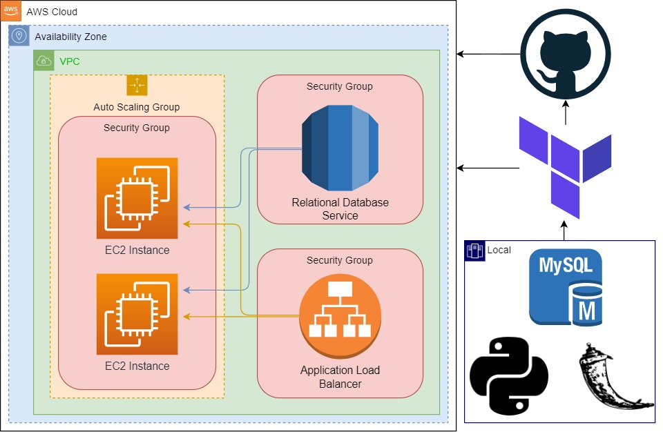
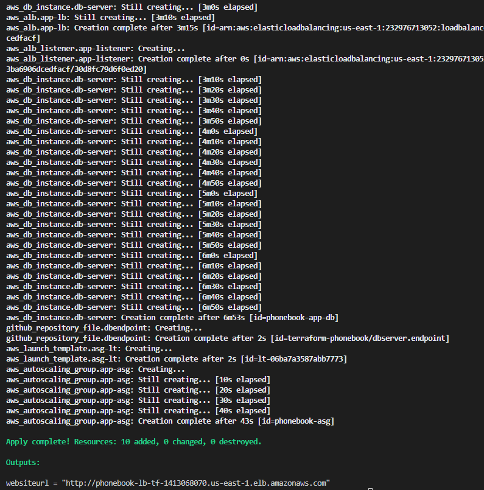
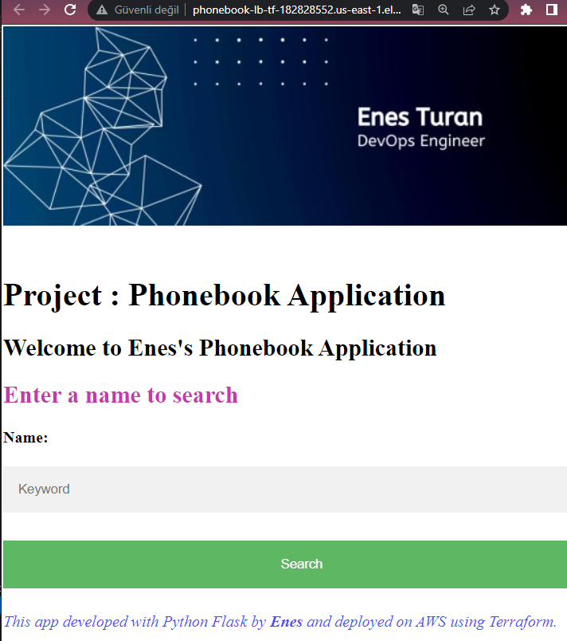

# Phonebook Application deployed on AWS Application Load Balancer with Auto Scaling and Relational Database Service using Terraform

## Description

The Phonebook Application aims to create a phonebook application in Python and deployed as a web application with Flask on AWS Application Load Balancer with Auto Scaling Group of Elastic Compute Cloud (EC2) Instances and Relational Database Service (RDS) using Terraform.

## Project Architecture



## Case Study Details

- Your company has recently started a project that aims to serve as phonebook web application. You and your colleagues have started to work on the project. Your teammates have developed the UI part the project as shown in the template folder and develop the coding part and they need your help to deploying the app in development environment.

- As a first step, you need to write program that creates a phonebook, adds requested contacts to the phonebook, finds and removes the contacts from the phonebook.

- Application should allow users to search, add, update and delete the phonebook records and the phonebook records should be kept in separate MySQL database in AWS RDS service. Following is the format of data to be kept in db.

  - id: unique identifier for the phone record, type is numeric.

  - person: full name of person for the phone record, type is string.

  - number: phone number of the person. type is numeric.

- All the interactions with user on phonebook app should be done in case insensitive manner and name of the person should be formatted so that, only the first letters of each words in the name of the person should be in capital letters. If the user inputs number in the username field, user should be warned with text message.

- Phone numbers in the app can be in any format, but the inputs should be checked to prevent string type. If the user inputs string in the number field, user should be warned with text message.

- Example for user inputs and respective formats

| Input in Username Field | Type     | Format to Convert                                         |
| :---------------------- | :------- | :-------------------------------------------------------- |
| ''                      | `string` | Warning -> 'Invalid input: Name can not be empty'         |
| enes                    | `string` | Enes                                                      |
| joHn doE                | `string` | John Doe                                                  |
| 62267                   | `string` | Warning -> 'Invalid input: Name of person should be text' |

| Input in Number Field | Type     | Format to Convert                                                    |
| :-------------------- | :------- | :------------------------------------------------------------------- |
| ''                    | `number` | Warning -> 'Invalid input: Phone number can not be empty'            |
| 1234567890            | `number` | 1234567890                                                           |
| 546347                | `number` | 546345                                                               |
| ten thousand          | `number` | Warning -> 'Invalid input: Phone number should be in numeric format' |

- As a second step, after you finish the coding, you are requested to deploy your web application using Python's Flask framework.

- You need to transform your program into web application using the `index.html`, `add-update.html` and `delete.html` within the `templates` folder. Note the followings for your web application.

  - User should face first with `index.html` when web app started and the user should be able to;

    - search the phonebook using `index.html`.

    - add or update a record using `add-update.html`.

    - delete a record using `delete.html`.

  - User input can be either integer or string, thus the input should be checked for the followings,

    - The input for name should be string, and input for the phone number should be decimal number.

    - When adding, updating or deleting a record, inputs can not be empty.

    - If the input is not conforming with any conditions above, user should be warned using the `index.html` with template formatting.

  - The Web Application should be accessible via web browser from anywhere.

- Lastly, after transforming your code into web application, you are requested to push your program to the project repository on the Github and deploy your solution in the development environment on AWS Cloud using Terraform to showcase your project. In the development environment, you can configure your Terraform file using the followings,


- The application should be created with new AWS resources.

- Template should create Application Load Balancer with Auto Scaling Group of Amazon Linux 2 EC2 Instances within default VPC.

- Application Load Balancer should be placed within a security group which allows HTTP (80) connections from anywhere.

- EC2 instances should be placed within a different security group which allows HTTP (80) connections only from the security group of Application Load Balancer.

- The Auto Scaling Group should use a Launch Template in order to launch instances needed and should be configured to;

  - use all Availability Zones.

  - set desired capacity of instances to `2`

  - set minimum size of instances to `1`

  - set maximum size of instances to `3`

  - set health check grace period to `300 seconds`

  - set health check type to `ELB`

- The Launch Template should be configured to;

  - prepare Python Flask environment on EC2 instance,

  - download the Phonebook Application code from Github repository,

  - deploy the application on Flask Server.

- EC2 Instances type can be configured as `t2.micro`.

- Instance launched by Terraform should be tagged `Web Server of Phonebook App`

- For RDS Database Instance;

  - Instance type can be configured as `db.t2.micro`

  - Database engine can be `MySQL` with version of `8.0.19`.

- Phonebook Application Website URL should be given as output by Terraform, after the resources created.

## Terraform

- Creating and deploying project resources on AWS using Terraform may take 10 minutes approximately.



## Expected Outcome



### At the end of the project, following topics are to be covered;

- Algorithm design

- Programming with Python

- Programming with SQL

- Web application programming with Python Flask Framework

- MySQL Database Configuration

- Bash scripting

- AWS EC2 Launch Template Configuration

- AWS EC2 Application Load Balancer Configuration

- AWS EC2 ALB Target Group Configuration

- AWS EC2 ALB Listener Configuration

- AWS EC2 Auto Scaling Group Configuration

- AWS Relational Database Service Configuration

- AWS EC2 Security Groups Configuration

- Terraform Configuration with AWS

- Terraform Configuration with Github

- Git & Github for Version Control System

### At the end of the project, you will be able to;

- show their coding skills using boolean/math operators, string formatting, if statements and functions within Python.

- apply web programming skills using HTTP GET/POST methods, template formatting, importing packages within Python Flask Framework

- configure connection to the `MySQL` database.

- work with a database using the SQL within Flask application.

- demonstrate bash scripting skills using `user data` section within launch template in Terraform to install and setup web application on EC2 Instance.

- demonstrate their configuration skills of AWS EC2 Launch Templates, Application Load Balancer, ALB Target Group, ALB Listener, Auto Scaling Group, RDS and Security Groups.

- configure Terraform template to use AWS Resources.

- show how to use Terraform to launch AWS Resources.

- apply git commands (push, pull, commit, add etc.) and Github as Version Control System.

---

### Get your existing subnets using the following command with AWS CLI:

```bash
aws ec2 describe-subnets --no-paginate --filters "Name=default-for-az,Values=true" | egrep "(VpcId)|(SubnetId)"
```

## Documentation Resources

- [Python Flask Framework](https://flask.palletsprojects.com/en/1.1.x/quickstart/)

- [Python Flask Example](https://realpython.com/flask-by-example-part-1-project-setup/)

- [Terraform AWS Provider Documentaion](https://registry.terraform.io/providers/hashicorp/aws/latest/docs)

- [AWS CLI Command Reference](https://docs.aws.amazon.com/cli/latest/index.html)
